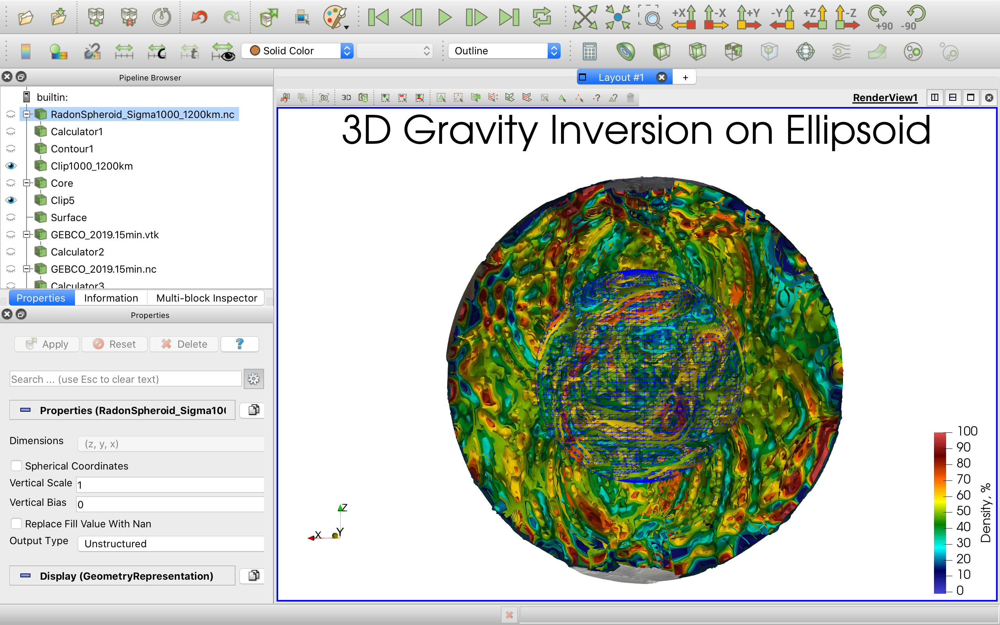

# 3D Gravity and Magnetic Inversion Models on Ellipsoid (Globe)

## Models by Sandwell and Smith Global Gravity Grid (grav_29.1.nc)

### Band-pass Filter 1000-1200 km: [NetCDF datafile](Sandwell_Smith_grav_29.1/RadonSpheroid_Sigma1000_1200km.nc)

### Band-pass Filter 400-600 km: [NetCDF datafile](Sandwell_Smith_grav_29.1/RadonSpheroid_Sigma400_600km.nc)

### Band-pass Filter 200-300 km: [NetCDF datafile](Sandwell_Smith_grav_29.1/RadonSpheroid_Sigma200_300km.nc)

